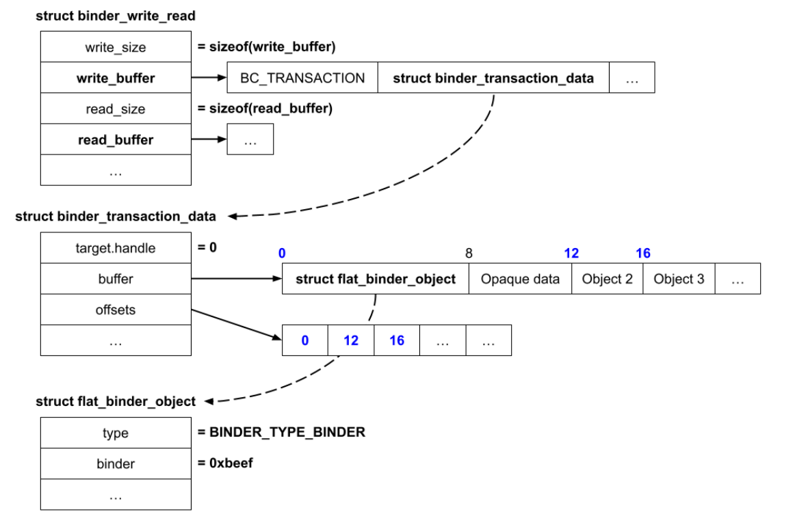

# Android Kernel Vulnerability Research Journey - Binder

Welcome to a new series I'd like to start, which will document the journey of my android kernel exploitation learning. 

As some of you know from my `pwnable.kr` series, I had finished the site, and after a short break and thinking, I had decided I'd like to delve into the world of android kernel vulnerability research. This stems mostly from my love to kernel exploitation as well as an interest specifically in the hard problems of Android (and in the future iOS) research.

This series will follow a roadmap I had designed for efficiently learning (at least for me) a completely new field in a hands-on manner. We will mostly learn new concepts and exploitation techniques using n-days (which I will research on my own and exploit), all the while learning the theory needed for each n-day.

To begin with, due to the high amount of android kernel compilation tutorials out there, I'll assume you can compile your own android kernel (for arm64) of any version with KASAN, full debug info and binder support. For help in that regard you can reach out to me @wired0ut anywhere or simply consult the nearest LLM. After you have your kernel, simply use busybox to create an initramfs and we should be good to go with QEMU system. 

## The Android Kernel

The android kernel is a modified linux kernel. Google modify LTS linux kernels and combine them with android capabilities in order to form what's known as an "Android Common Kernel", AKA ACK. The newer kernels are also known as a "Generic Kernel Image", AKA GKI kernels.

This basically means that while it is very alike our known linux kernel, there are some patches and things we're used to like privilege escalation methods differ because we have different running situations etc. Not only that, but the attack surfaces differ due to specific android interfaces (such as Binder), and the fact that android kernels usually have SELinux enabled.

I don't want to dive too deep in here, given it is a redundancy and does not really matter for us right now as we want to dive into specifics, but this is a high-level summary that gives us what we need for now.

## Binder

Binder is a very common attack surface for Android, and it will be the first we will master. It is a system for interprocess communication (IPC) which grants processes the ability to communicate with each other. It does so by providing a means to execute function calls in another process which are completely transparent to the caller.

When we talk about binder, the term we use for the calling process is a `client`, and the term we use for its endpoint is a `binder proxy` or simply a `proxy`. The process being called is the `server` and its endpoint is the `binder node` or simply `node`.

Each `node` can expose and implement its own interface. Using our `proxy` the `client` can then execute methods on a `node` interface as if it is a local function:

```c
void* result = nodeInterface.foo(...) // -> nodeInterface is our `proxy` object.
```

Binder is composed of the userspace libraries (`libbinder.so` and `libhwbinder.so`) as well as a kernel driver (`/dev/binder`) in the ACK. When I use the term Binder from now on, I refer to the device driver.

When you run Android, you have a lot of apps running on your phone. Most of these apps are untrusted, and thus they are sandboxed. Due to that, inter-process communication there occurs mostly using Binder. There are even apps which are assigned the `isolated_app` SELinux content which is even more restrictive, but they still have access to Binder. 

We can deduce therefore that Binder is a wide attack surface because it is by default accessible to these apps as well. A lot of the CVEs we will tackle in this series are binder vulnerabilities (Waterdrop, Bad Binder, etc.) due to this being such a widely used attack surface.

### Using Binder

#### Binder Proxy Initialization

A `client` using binder must begin with opening the device and then create a memory mapping to be used by Binder to store transaction data. The mapping is read-only for the `client`, but the driver may also write to it.

```c
int fd = open("/dev/binder", O_RDWR, 0);
void* memmap = mmap(NULL, 0x1000, PROT_READ, MAP_PRIVATE, fd, 0);
```

This initializes a binder `proxy`.

#### Connecting With Another Process

Binder uses objects such as `struct binder_node` (the node we've spoken about before) and `struct binder_ref`. in order to manage communication channels between processes. The easiest way to think of this is as the kernel-side representation of a server (the node) and its clients (the refs).

Process A creates a Binder object, which in turn causes Binder to create a `struct binder_node` in its context. Process A sends it to process B. At this point, Binder creates a `struct binder_ref` for process B and links it back to process A's `binder_node`. Process B now uses a handle of its own (which points to the ref) in order to send messages. Using that handle, Binder finds the `binder_ref` which leads to the `binder_node` and then it knows where to send the data.

#### Binder Context Manager

When we create the Binder object and send it to process B, how can we send it, if there is no connection between them in the first place? 

Binder enables a special (and singular) process to claim itself as the Binder Context Manager (BCM) using the `BINDER_SET_CONTEXT_MGR` `ioctl`. The BCM acts as a special binder endpoint *always* accessible at `ref` 0, which serves as a middleman to make Binder endpoints accessible to each other. 

Let's look at an example of what we've mentioned before, in the realm of the BCM:

Process A sends the `node` to the BCM, which in turn receives a `ref`. Another process (B) may then initiate a transaction to the BCM asking for the `ref` of process A. BCM returns the `ref`, and then there is a connection between these two processes as process B can now send transactions using process A's `ref`.

The ServiceManager process claims itself as the BCM during startup. System services register their Binder `nodes` with the BCM in order to be discoverable by other applications.

#### Performing Transactions

Contrary to sending data normally, in Binder we perform IPC interactions by using the Binder `ioctl` interface like so:

```c
struct binder_write_read binder_wr = { ... };
ioctl(fd, BINDER_WRITE_READ, &binder_wr);
```

Let's look at `struct binder_write_read`:

```c
struct binder_write_read {
	binder_size_t		write_size;	/* bytes to write */
	binder_size_t		write_consumed;	/* bytes consumed by driver */
	binder_uintptr_t	write_buffer;
	binder_size_t		read_size;	/* bytes to read */
	binder_size_t		read_consumed;	/* bytes consumed by driver */
	binder_uintptr_t	read_buffer;
};
```

The `write_buffer` and `read_buffer` pointers are userspace buffers containing a list of commands from the client to the driver / from the driver to the client respectively. 

We can look at an example for such a transaction here:



We don't fully understand everything yet, but we can see that the `write_buffer` points to a bufdfer that contains a list of commands and data. The `BC_TRANSACTION` command tells Binder to send a transaction. The `read_buffer` points to a buffer that will be filled by Binder when there are incoming transactions.

`struct binder_transaction_data` contains a target handle (which is the reference ID of the target), and two buffers which are `buffer` and `offsets`. The `buffer` is a buffer containing a mix of Binder objects (`struct flat_binder_object`) as well as opaque data, and the `offsets` is a buffer of offsets at which every Binder object is found in the `buffer`. Meaning, it is an array of indices for the `struct flat_binder_object` in the `buffer`. 

When the target process calls `BINDER_WRITE_READ` in the `ioctl` of the `/dev/binder`, it will receive a copy of `struct binder_transaction_data` in the `read_buffer`.
